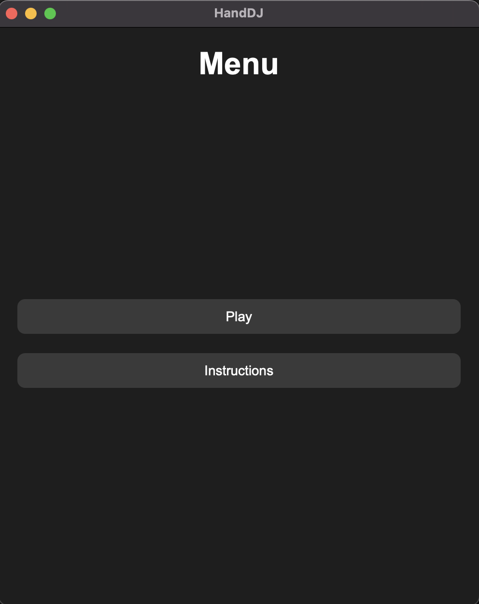
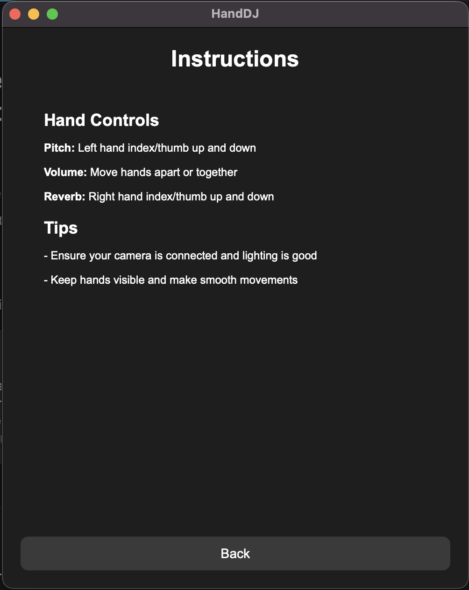
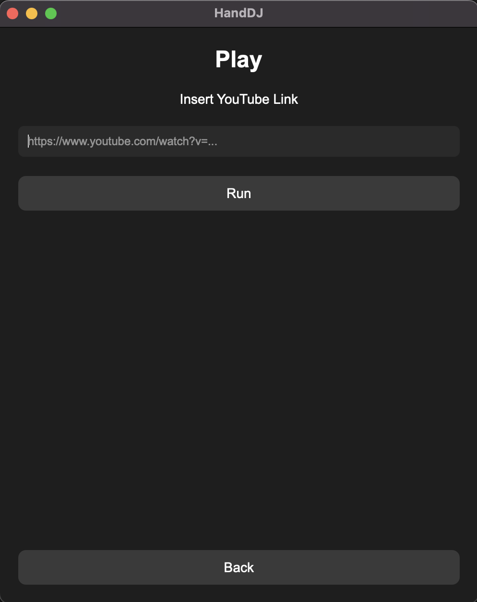

# HandDJ

A gesture-controlled DJ app that uses your webcam and MediaPipe to manipulate audio with hand movements. Paste a YouTube link, and control pitch, volume, and reverb in real time.


## Setup

Requires Python 3.10.

```bash
cd hand-dj

# install dependencies
pip install -r mac_requirements.txt   # macOS
pip install -r win_requirements.txt   # Windows

# run
cd src
python hand_dj.py
```

Make sure your camera is connected before running.

## Controls

- **Pitch**: left hand index/thumb up and down
- **Volume**: move hands apart or together
- **Reverb**: right hand index/thumb up and down

Each control can be toggled on/off from the control page.

## How It Works

**Hand tracking** — MediaPipe detects up to 2 hands per frame via OpenCV. Landmark positions are smoothed between frames using exponential moving averages to reduce jitter from raw detection.

**Gesture mapping** — The distance between thumb tip and index finger tip (landmarks 4 and 8) on each hand is mapped to an audio parameter using linear interpolation. Left hand controls pitch, right hand controls reverb. Volume uses the distance between both hands' midpoints.

**Audio processing** — Audio is downloaded from YouTube via yt-dlp. Effects (pitch shift, reverb, gain) are applied using Pedalboard, which processes raw PCM samples through a chain of VST-style effects. Pitch and reverb require a full re-render of the audio buffer, so parameter updates are throttled to every 500ms. Volume changes go straight to the mixer to stay responsive.

**Smoothing** — Hand inputs are buffered (last 5 readings) and averaged, then blended with the current value using a smoothing factor. Volume uses a lower smoothing factor (0.1 vs 0.2) so it feels more responsive to hand movement.

## Screenshots





## License

MIT — Terrance Wong
